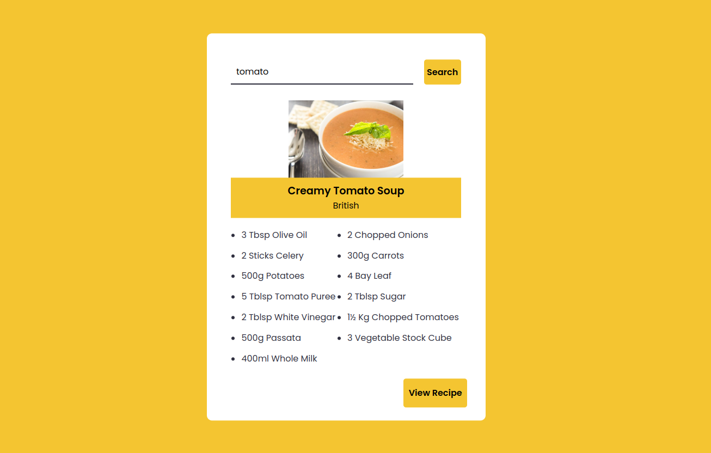

# Recipe App

A recipe application built using HTML, CSS, and JavaScript with the integration of an external API.

## Features
- Search for recipes by keyword
- Display recipe details including ingredients and instructions

## Technologies Used
- HTML: Structure and content of the web page
- CSS: Styling and visual design of the app
- JavaScript: Functionality and interactivity
- [External API](https://www.themealdb.com/api/json/v1/1/search.php?s=)

### [Live Demo](https://recipe-diy.vercel.app/) on Vercel

  

## Contributing
If you'd like to contribute to this project, feel free to fork the repository and submit pull requests with your improvements.
